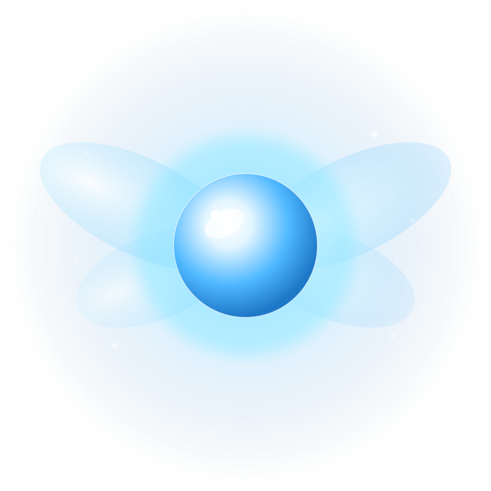

<div align="center">



# Hey Watch Out

**Take breaks. Look away. Breathe.**

A free, multi-monitor break reminder for macOS and Windows.
Built because [Time Out](https://www.dejal.com/timeout/) hid its prettiest animation behind a subscription.

[](LICENSE)
[](#)
[](https://www.electronjs.org/)
[](#)

</div>

---

## Why

I use both macOS and Windows for work. I wanted a single break reminder that:

- Blocks **every screen** (including rotated portrait displays)
- Has a calm **falling-leaves** animation without paying a subscription
- Lets me skip when life happens
- Is mine, on my terms

So I built it.

## Features

- **Multi-monitor lockdown** — covers every display including portrait and flipped portrait, hides taskbar and menu bar
- **Configurable schedule** — interval and break duration to taste
- **Fade in/out** — smooth window opacity transitions, configurable seconds
- **Background options**:
  - **Falling leaves** overlay (pure CSS, ships with zero binary assets) — works over solid color, image, or video
  - Solid color (any hex)
  - Your own **image** or animated **GIF**
  - Your own **video** (mp4 / webm / mov)
- **Sound options**:
  - Default **synthesized chime** (Web Audio, no audio file shipped)
  - Your own audio file (mp3 / wav / ogg / m4a / aac)
  - Volume slider with numeric input
- **Countdown**:
  - Large centered
  - Small left or right of the progress bar
  - Hidden
- **Progress bar** left-to-right showing time elapsed in current break
- **Skip button** with optional grace-period delay, plus `Esc` shortcut
- **Floating mini-bar** with countdown to next break — drag from anywhere, gear icon for settings
- **System tray**: take break now, pause/resume, settings, quit
- **Launch at login** toggle (macOS Launch Services / Windows registry)
- Settings persisted via `electron-store`

## Quick start

Requires Node.js 18 or newer.

```bash
npm install
npm start
```

The app lives in your system tray / menu bar. Right-click it → **Settings**.

## Build installers

```bash
npm run build:mac     # .dmg + .zip
npm run build:win     # NSIS installer + portable .exe
npm run build:all     # both
```

Outputs land in `dist/`.

### Unsigned builds

This repo ships unsigned. No Apple Developer account or Windows code-signing cert required — meant for personal, single-machine use.

- **macOS Gatekeeper**: first launch may say *"Hey Watch Out can't be opened"*. Right-click the `.app` → **Open** → **Open**.
  Alternatively in Terminal:
  ```bash
  xattr -cr "/Applications/Hey Watch Out.app"
  ```
- **Windows SmartScreen**: first launch shows *"Windows protected your PC"*. Click **More info** → **Run anyway**.

Both OSes remember the decision after that.

## Configuration

Open **Settings** from the tray icon or mini-bar gear button. Every option is live: changes save automatically and apply to the next break.

| Section     | Options                                                                                |
| ----------- | -------------------------------------------------------------------------------------- |
| Schedule    | Interval (minutes), break duration (seconds), take break now, pause                    |
| Fade        | Fade-in seconds, fade-out seconds                                                      |
| Background  | Type (color / image / video), color picker, file path, fit, falling-leaves overlay     |
| Sound       | Enabled toggle, custom audio file, volume                                              |
| Text        | Title, subtitle, color                                                                 |
| Countdown   | Position: center / left / right / hidden                                               |
| Skip        | Allow skipping, reveal delay (seconds)                                                 |
| Mini bar    | Show floating countdown bar                                                            |
| Startup     | Launch at login                                                                        |

Personal media (your custom image/audio) lives **outside** the repo — Settings stores the absolute path, so the file can sit anywhere on disk.

## Tech stack

- [Electron 28](https://www.electronjs.org/) — cross-platform desktop
- [electron-store](https://github.com/sindresorhus/electron-store) — JSON-backed settings
- [electron-builder](https://www.electron.build/) — DMG / NSIS / portable packaging
- Pure CSS for falling leaves (emoji `🍂 🍁 🍃`)
- Web Audio API for the default chime
- Zero shipped binary media assets — small download, no licensing headaches

## Project structure

```
hey-watch-out/
├── main.js               # Electron main process, tray, scheduler, IPC
├── preload.js            # contextBridge → window.api
├── renderer/
│   ├── overlay.html/css/js   # the fullscreen break overlay
│   ├── settings.html/css/js  # settings window
│   └── minibar.html/css/js   # floating countdown bar
├── assets/
│   ├── icon.svg          # source app icon (Navi-style orb)
│   ├── icon.icns/.ico    # generated platform icons
│   └── tray.png / @2x    # tray icon
└── package.json
```

## Roadmap

Nice-to-haves I might pick up later:

- [ ] Smart pause when in a meeting (camera/mic active)
- [ ] Per-day scheduling (work hours only)
- [ ] Stretching prompts library
- [ ] Linux build (it's in `package.json` but untested)

## License

[MIT](LICENSE) — do whatever, it's your machine.

---

<div align="center">

Made by <a href="mailto:macgalaviz@hotmail.com">Miguel Cabañas</a>

</div>
